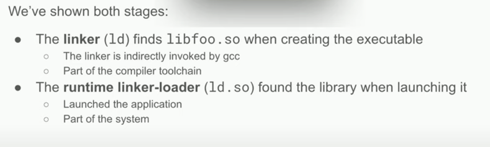
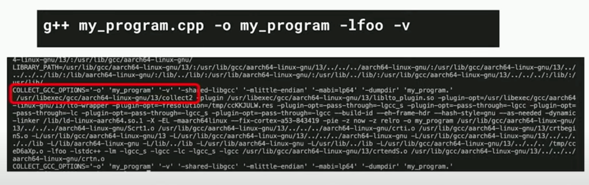
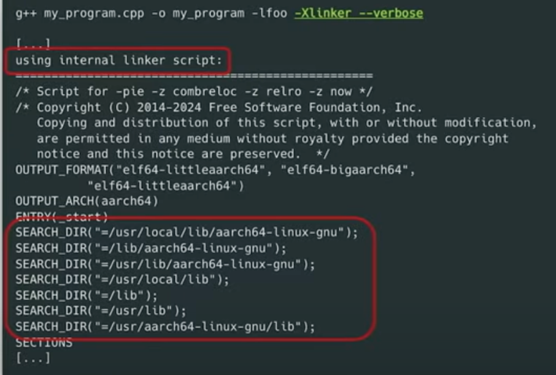
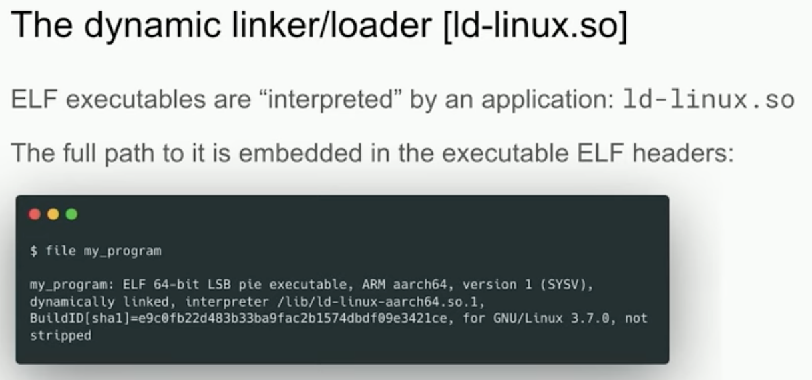
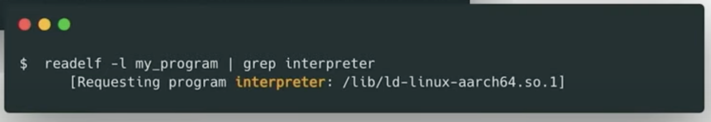

# Understanding Linking in Linux for C++ Applications

# Youtube video "C++ Shared Libraries and Where To Find Them - Luis Caro Campos - CppCon 2024" - Talking Points

See youtube video "C++ Shared Libraries and Where To Find Them - Luis Caro Campos - CppCon 2024" (https://youtu.be/Ik3gR65oVsM)


## Two-Stage Linking Process
[Video reference: 6:40](https://youtu.be/Ik3gR65oVsM?t=401)



The compiler links the app to build it and the system links the app to the system to run it.

## Video talking points

	==> At around 6:50 he seems to mention the -v 'verbose' command to interrogate the linker (https://youtu.be/Ik3gR65oVsM?t=412)?



	==> At around 8:56 he seems to explain how to pass '-Xlinker --verbose'  to make the linker show where it searches  (https://youtu.be/Ik3gR65oVsM?t=536)?



	==> At around 9:37 he seems to explain how to interrogate the Linux linker loader with the 'file' command (https://youtu.be/Ik3gR65oVsM?t=577)?



		==> It seems my macOS has the file command?

```sh
kjell-olovhogdahl@MacBook-Pro ~/Documents/GitHub/bang % file -v
file-5.41
magic file from /usr/share/file/magic
kjell-olovhogdahl@MacBook-Pro ~/Documents/GitHub/bang % ls       
CMakeLists.txt		LICENSE			_config.yml		conanfile.py		index.md		src
CMakeUserPresets.json	README.md		build			docs			init_tool_chain.zsh	test_package
kjell-olovhogdahl@MacBook-Pro ~/Documents/GitHub/bang % file build/Release/bang 
build/Release/bang: Mach-O 64-bit executable arm64
kjell-olovhogdahl@MacBook-Pro ~/Documents/GitHub/bang % 
```

	==> At around 9:59 he seems to explain how to interrogate an ELF binary using 'readelf' command (https://youtu.be/Ik3gR65oVsM?t=599)?



		==> It seems on my macOS here is no 'readelf' but 'otool' is the program with similar abilitites?

    ```sh
    kjell-olovhogdahl@MacBook-Pro ~/Documents/GitHub/bang % readelf build/Release/bang
    zsh: command not found: readelf
    kjell-olovhogdahl@MacBook-Pro ~/Documents/GitHub/bang % otool build/Release/bang
    error: /Applications/Xcode.app/Contents/Developer/Toolchains/XcodeDefault.xctoolchain/usr/bin/otool: one of -fahlLtdoOrTMRIHCGScisPx or --version must be specified
    Usage: /Applications/Xcode.app/Contents/Developer/Toolchains/XcodeDefault.xctoolchain/usr/bin/otool [-arch arch_type] [-fahlLDtdorSTMRIHGvVcXmqQjCP] [-mcpu=arg] [--version] <object file> ...
      -f print the fat headers
      -a print the archive header
      -h print the mach header
      -l print the load commands
      -L print shared libraries used
      -D print shared library id name
      -t print the text section (disassemble with -v)
      -x print all text sections (disassemble with -v)
      -p <routine name>  start dissassemble from routine name
      -s <segname> <sectname> print contents of section
      -d print the data section
      -o print the Objective-C segment
      -r print the relocation entries
      -S print the table of contents of a library (obsolete)
      -T print the table of contents of a dynamic shared library (obsolete)
      -M print the module table of a dynamic shared library (obsolete)
      -R print the reference table of a dynamic shared library (obsolete)
      -I print the indirect symbol table
      -H print the two-level hints table (obsolete)
      -G print the data in code table
      -v print verbosely (symbolically) when possible
      -V print disassembled operands symbolically
      -c print argument strings of a core file
      -X print no leading addresses or headers
      -m don't use archive(member) syntax
      -B force Thumb disassembly (ARM objects only)
      -q use llvm's disassembler (the default)
      -Q use otool(1)'s disassembler
      -mcpu=arg use `arg' as the cpu for disassembly
      -j print opcode bytes
      -P print the info plist section as strings
      -C print linker optimization hints
      --version print the version of /Applications/Xcode.app/Contents/Developer/Toolchains/XcodeDefault.xctoolchain/usr/bin/otool
    kjell-olovhogdahl@MacBook-Pro ~/Documents/GitHub/bang % otool -S build/Release/bang
    ```
  

---

# Q&A Documentation Index

## ChatGPT Q&A Sessions

- [C++ Linking Phases](chatgpt-qa-linking-phases.md) - Detailed breakdown of static and dynamic linking phases in C++ applications

## Claude Code Assistant Q&A Sessions

- [C++ Linking Stages and Linux Commands](claude-code-qa-linking-stages.md) - Understanding the two-stage linking process in C++ applications and the Linux commands involved
- [macOS vs Linux Commands for Binary Analysis](claude-code-qa-macos-vs-linux-commands.md) - Command equivalents between macOS and Linux for analyzing binaries
